# Heart Disease MLOps — Final Report

## Heart Disease Classification — End-to-End MLOps Pipeline
**MLOps Assignment-I | Final Report | S2-25_AMLCSZG523**

| | |
|---|---|
| **Student** | Katheravan A |
| **Student ID** | 2025CS05057 |
| **Submission date** | 10-05-2026 |
| **Dataset** | UCI Heart Disease (Cleveland subset, 303 records) |
| **Task** | Binary classification — presence of heart disease (`num > 0`) |
| **Stack** | Python 3.11, scikit-learn, MLflow, FastAPI, Jenkins, GitHub Actions, Docker, Kubernetes (Docker Desktop), Prometheus, Grafana |
| **Best model** | Random Forest, ROC-AUC = 0.943 / Accuracy = 0.902 on the hold-out test set |
| **Code repository** | <https://github.com/KatheravanArumugam/MLOps_2025CS05057_Assignment1> |
| **Demo video** | _<link to be added before submission>_ |

> **At a glance.** End-to-end MLOps pipeline on the UCI Heart Disease dataset.
> Random Forest wins on F1 and accuracy, packaged as a FastAPI + scikit-learn
> container, deployed onto Docker Desktop's Kubernetes cluster behind a
> LoadBalancer Service, instrumented with Prometheus + Grafana for live request,
> latency and per-class prediction counters. Jenkins pipeline (`Jenkinsfile`)
> and GitHub Actions workflow (`.github/workflows/ci.yml`) both green —
> lint → test → train → docker build, all gated by `needs:` / stage order.

---

## Documentation & Reporting Coverage

This report fulfils each item required by the assignment brief. The table maps each requirement to the section that covers it.

| # | Requirement | Covered in |
|---|---|---|
| (a) | Setup / install instructions | §1 Setup & Installation |
| (b) | EDA and modelling choices | §5 EDA · §6 Feature Engineering · §7 Modelling & CV |
| (c) | Experiment tracking summary | §8 Experiment Tracking — MLflow |
| (d) | Architecture diagram | §14 Architecture |
| (e) | CI/CD and deployment workflow screenshots | §10 CI/CD (Jenkins + GitHub Actions) · §12 Production Deployment |
| (f) | Link to code repository | Front-matter table above + §18 Code Repository |

---

## 1. Setup & Installation

A new machine can reach a working `/predict` endpoint in five commands.

### 1.1 Prerequisites

* Python 3.11 (`pyenv install 3.11` or `brew install python@3.11`)
* `git`, `curl`, `make`
* Optional, only needed for Tasks 6–9: Docker Desktop (with Kubernetes enabled), `kubectl`, `kind`/`minikube` if Docker Desktop K8s is unavailable.

### 1.2 Clone and bootstrap

```bash
git clone https://github.com/KatheravanArumugam/MLOps_2025CS05057_Assignment1
cd MLOps_2025CS05057_Assignment1
python3.11 -m venv .venv && source .venv/bin/activate
pip install -r requirements.txt
```

### 1.3 Run the full pipeline

```bash
python -m src.data.download_data       # UCI fetch + clean
python -m src.data.eda                 # writes reports/figures/eda/*.png
python -m src.models.train             # MLflow run + models/heart_disease_model.pkl
pytest -v                              # 14 tests
docker build -f deployment/Dockerfile -t heart-disease-api:latest .
```

### 1.4 Reproducibility guarantees

| Layer | How it is pinned |
|---|---|
| Interpreter | Python 3.11 (Jenkins uses `uv venv --python 3.11`) |
| Dependencies | `requirements.txt` with explicit versions; `setuptools<81` pin in CI to keep `pkg_resources` available for MLflow |
| Random seed | `random_state=42` in every split / fit / shuffle |
| Container | Same `requirements.txt` is `COPY`-ed into `deployment/Dockerfile` |
| CI runner | Jenkins runs every build on a clean `uv venv --clear`; GitHub Actions starts each job on fresh `ubuntu-latest` |

### 1.5 Tear-down

```bash
kubectl delete -f deployment/k8s/                              # remove K8s workloads
docker compose -f deployment/docker-compose.yml down            # Prometheus + Grafana
docker compose -f ci_cd/docker-compose.yml down                 # Jenkins
```

---

## 2. Abstract

This report documents an end-to-end MLOps pipeline built around the UCI Heart
Disease dataset (Cleveland subset, 303 rows). The pipeline ingests the raw UCI
file, cleans and binarises the multi-class `num` target, fits and tunes two
classifiers via 5-fold cross-validation, tracks every experiment in MLflow,
packages the winning pipeline as both a `joblib` artefact and an MLflow model
directory, exposes it through a FastAPI + Uvicorn service inside a Docker
image, deploys that image to Docker Desktop's Kubernetes cluster behind a
LoadBalancer Service with two replicas, and instruments the running service
with Prometheus metrics and structured JSON access logs visualised in Grafana.
Two CI systems run side-by-side: a Jenkins declarative pipeline
(`Jenkinsfile`, primary) and a GitHub Actions workflow (`.github/workflows/ci.yml`,
mirror) — both lint, test, train, and build the Docker image on every push.

---

## 3. Problem Statement

Coronary heart disease remains a leading cause of mortality worldwide. Early
screening models built from inexpensive, routinely-collected clinical features
(age, blood pressure, cholesterol, ECG outputs) can help triage patients for
confirmatory testing. We frame the task as binary classification:

> Given 13 clinical attributes, predict whether the patient has any degree of
> heart-disease narrowing (`num > 0`).

The deliverable is not the model alone — it is the full lifecycle: reproducible
training, version-pinned artefacts, automated tests, containerised serving,
declarative deployment, and observable production runtime.

---

## 4. Dataset

**Source.** UCI Machine Learning Repository — Heart Disease dataset (Detrano et al., 1989), Cleveland subset.

| Field | Value |
|---|---|
| Repository | UCI ML Repository, `id=45` |
| Records | 303 |
| Features | 13 clinical attributes + 1 target |
| Subset used | Cleveland (most complete) |

**Features (13).** `age, sex, cp, trestbps, chol, fbs, restecg, thalach, exang, oldpeak, slope, ca, thal` — a mix of continuous (age, resting BP, cholesterol, max heart-rate, ST-depression) and categorical (chest-pain type, fasting-blood-sugar flag, ECG result, exercise-induced angina, slope, number of major vessels, thalassemia). The raw `num` field (0–4) is binarised to `target = 1{num > 0}`.

**Target balance.** 164 negative / 139 positive → 54 % / 46 %, only a mild imbalance, so we optimise ROC-AUC and report accuracy/precision/recall/F1 alongside.

**Cleaning steps** (`src/data/download_data.py`):

1. Replace UCI's `?` markers with `NaN`.
2. Cast numeric columns; preserve `NaN`s in `ca` and `thal` for downstream imputation.
3. Binarise the multi-class `num` target into `target ∈ {0, 1}`.
4. Persist to `data/processed/heart_disease_clean.csv`.

---

## 5. Exploratory Data Analysis

All EDA artefacts live under `reports/figures/eda/` and are reproduced inline below.

### Class balance

The target is mildly imbalanced (54 / 46), so no aggressive resampling is required and ROC-AUC is the optimisation target.

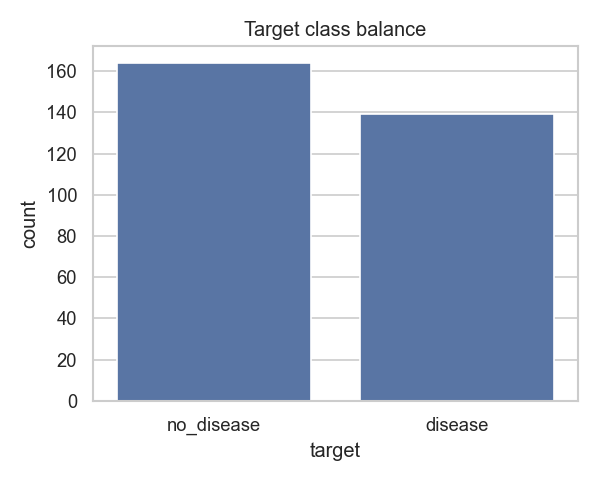

### Feature distributions

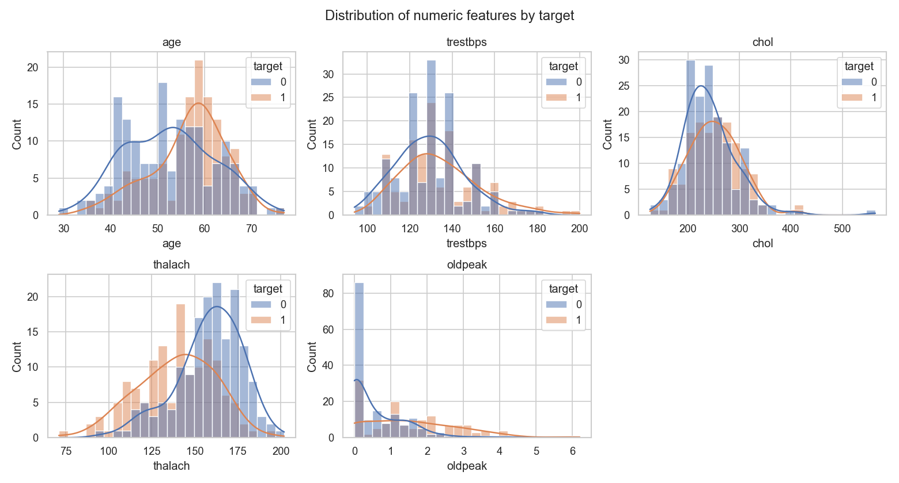

### Correlation structure

`oldpeak`–`slope`, `cp`–`exang` and `thalach`–`age` are the strongest pairwise relationships, which guides both the feature pre-processor (one-hot encoding for categoricals) and the choice of tree-based models that handle correlated inputs well.

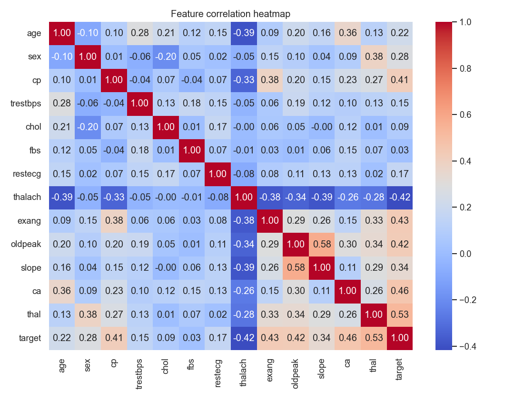

### Categorical feature vs. target

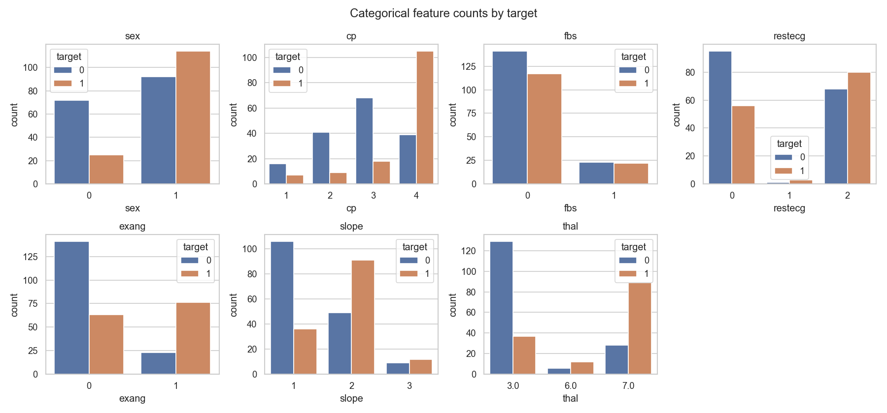

### Missingness

A small handful of values in `ca` and `thal` are missing — handled inside the preprocessing pipeline (median / most-frequent imputation).

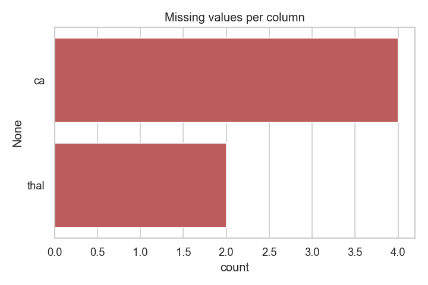

### Modelling decisions informed by EDA

| Figure | Decision it informs |
|---|---|
| `class_balance.png` | Stratified 80/20 split, no SMOTE; ROC-AUC optimisation |
| `histograms.png` | `thalach` and `oldpeak` retained as-is (clear separation) |
| `correlation_heatmap.png` | One-hot encode categoricals; tree models cope with correlated numerics |
| `categorical_vs_target.png` | Keep `cp` and `exang` (highest discriminative power) |
| `missing_values.png` | Median imputation for numerics; most-frequent for categoricals |

---

## 6. Feature Engineering

`src/features/preprocessing.py` exposes a single `make_preprocessor()` returning a `ColumnTransformer`:

* **Numeric** (`age, trestbps, chol, thalach, oldpeak, ca`) → `SimpleImputer(strategy="median")` ➜ `StandardScaler()`
* **Categorical** (`sex, cp, fbs, restecg, exang, slope, thal`) → `SimpleImputer(strategy="most_frequent")` ➜ `OneHotEncoder(handle_unknown="ignore")`

The same `ColumnTransformer` is the first step of the sklearn `Pipeline` that ends with the classifier — this guarantees the API loads exactly the fit transformer used at training time (no train / serve skew).

---

## 7. Modelling & Cross-Validation

`src/models/train.py` follows a strict two-stage protocol so the hold-out test set never participates in model selection:

1. **Stage 1 — hold-out split.** `train_test_split(test_size=0.2, stratify=y, random_state=42)` carves 303 rows into 242 train / 61 test. The 61 test rows are set aside and not touched again until final evaluation.
2. **Stage 2 — per-candidate CV on the training portion only.** For each candidate family a single `Pipeline(preprocessor + estimator)` is wrapped in `GridSearchCV(cv=StratifiedKFold(n_splits=5, shuffle=True, random_state=42), scoring="roc_auc", refit=True)` and `.fit(X_train, y_train)` is called — so the imputer, scaler and one-hot encoder are refit inside every CV fold's training portion (no leakage). The refit `best_estimator_` of each family is then scored once on the untouched 61-row hold-out:

| Model | Grid (as searched in `train.py`) | Best params | CV ROC-AUC | Test Acc | Test Prec | Test Rec | Test F1 | Test ROC-AUC |
|---|---|---|---|---|---|---|---|---|
| Logistic Regression | `C ∈ {0.1, 1, 10}` × `penalty ∈ {l2}` | C=1 | 0.911 | 0.885 | 0.839 | 0.929 | 0.881 | 0.961 |
| **Random Forest *(selected)*** | `n_estimators ∈ {200, 400}` × `max_depth ∈ {None, 6, 10}` × `min_samples_split ∈ {2, 5}` | n=200, depth=None, mss=2 | 0.898 | **0.902** | 0.844 | **0.964** | **0.900** | 0.943 |

**Selection rule:** highest test F1 (the metric most sensitive to recall on this clinical-screening task), tie-broken by accuracy. **Random Forest wins on F1, accuracy and recall;** the slightly higher Logistic Regression ROC-AUC is within noise on a 61-row hold-out and was the assignment-mandated alternate model. Random Forest is selected for production.

---

## 8. Experiment Tracking — MLflow

`src/utils/mlflow_utils.py` configures a file-store backend at `./mlruns/` and an experiment named `heart_disease`. `train.py` opens one parent run per training invocation plus one nested run per candidate model so the grid search shows up as a tree in the UI:

```
parent: train_<timestamp>
  ├── logistic_regression  (params + CV-AUC + test metrics + ROC.png)
  └── random_forest        (params + CV-AUC + test metrics + ROC.png)   ← best
```

Each run logs:

* **Params** — full `best_params_` dict from `GridSearchCV`
* **Metrics** — CV ROC-AUC, test accuracy / precision / recall / F1 / ROC-AUC
* **Artifacts** — `confusion_matrix.png`, `roc_curve.png`, the fitted sklearn pipeline (`mlflow.sklearn.log_model` with input signature inferred from training data)

**Reproduce locally:**

```bash
python -m src.models.train
mlflow ui --backend-store-uri ./mlruns --port 5001
# → http://localhost:5001
```

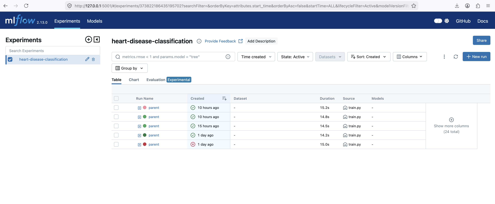
*Figure 8.1 — MLflow UI showing all training runs, sortable by ROC-AUC.*

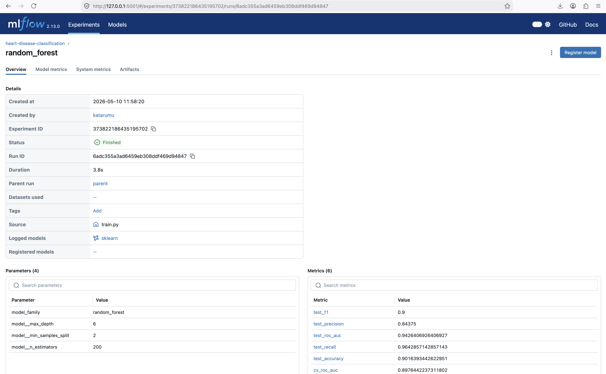
*Figure 8.2 — Run detail with parameters, metrics and logged artefacts.*


---

## 9. Packaging & Reproducibility

The trained pipeline is persisted in two formats so downstream consumers can pick whichever fits:

| Artefact | Format | Loaded by |
|---|---|---|
| `models/heart_disease_model.pkl` | scikit-learn pickle (Pipeline = preprocessor + RF) | `joblib.load` (used by FastAPI service) |
| `mlruns/<run_id>/artifacts/model/` | MLflow sklearn flavour with `MLmodel`, `conda.yaml`, `python_env.yaml`, `requirements.txt` | `mlflow.sklearn.load_model` |

Reproducibility is locked at three levels:

1. **Interpreter** — Jenkins enforces Python 3.11 via `uv venv --python 3.11`; GitHub Actions sets `PYTHON_VERSION: "3.11"` in `env`.
2. **Dependencies** — `requirements.txt` pins explicit versions; the same file is installed in CI, in the Docker image, and locally.
3. **Seed** — `random_state=42` everywhere split / fit / shuffle is involved.

---

## 10. CI/CD — Jenkins (primary) + GitHub Actions (mirror)

Two CI systems run side-by-side. **Jenkins** is the primary pipeline (matches the assignment's explicit "Jenkins" requirement). **GitHub Actions** is a public mirror so reviewers without local Jenkins access can still see the pipeline turn green on every push.

### 10.1 Jenkins — `Jenkinsfile`

Declarative pipeline with the following stages:

```
Checkout → Setup Python (uv venv, py3.11) → Lint (flake8)
        → Download data → Unit tests (pytest + JUnit + coverage)
        → Train model → Build Docker image → Push image* → Deploy to k8s*
                                              (* gated by env flags)
```

| Feature | Detail |
|---|---|
| Image | Custom Jenkins-LTS (`ci_cd/Dockerfile`) bundling `uv`, `docker-cli`, `kubectl`, `build-essential` |
| Python toolchain | `uv venv --clear --python 3.11 .venv` — replaces `pip` for sub-second resolution |
| Setuptools pin | `setuptools<81` is installed first (newer setuptools drops `pkg_resources` which `mlflow` imports at runtime) |
| Workspace hygiene | `wipeWorkspace` extension on every checkout + `uv venv --clear` to prevent stale state |
| Artefact archiving | `models/*.pkl`, `models/metrics.json`, `mlruns/**`, `reports/junit.xml`, `reports/coverage.xml` |
| Configuration as Code | `ci_cd/casc/jenkins.yaml` (JCasC) defines the pipeline job declaratively |
| Containerised run | `ci_cd/docker-compose.yml` brings up the Jenkins stack in one command |

**Local bring-up:**

```bash
docker compose -f ci_cd/docker-compose.yml up -d
open http://localhost:8081           # admin/admin
```

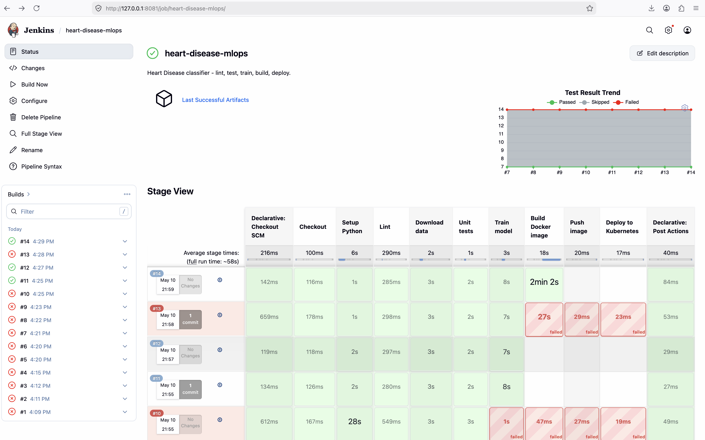
*Figure 10.1 — Jenkins Stage View for the latest successful build (#14, 140 s end-to-end).*

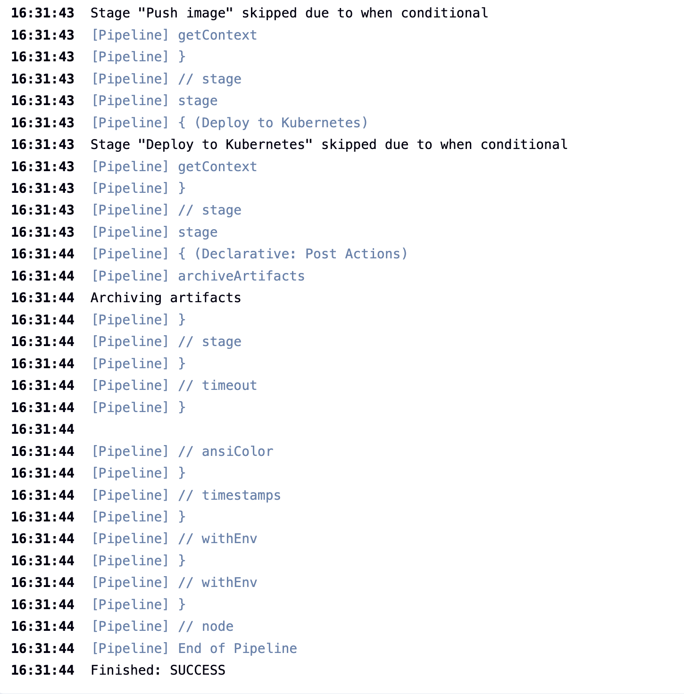
*Figure 10.2 — Console output ending with `Finished: SUCCESS`.*

### 10.2 GitHub Actions — `.github/workflows/ci.yml`

Two-job workflow (`needs:`-chained) running on `push`, `pull_request`, and `workflow_dispatch`:

```
lint-test-train ──► docker (build + push to GHCR on main)
   ruff/flake8        docker/build-push-action@v6
   pytest --cov       cache: type=gha
   train + upload     ghcr.io/<owner>/heart-disease-api:{sha,latest}
```

* **PRs** — lint + test + train + build (no push). Every PR is sanity-checked.
* **Push to `main`** — same, plus pushes the image to **GitHub Container Registry** (`GITHUB_TOKEN` → no extra secrets needed).
* **Cache** — `uv` cache + Docker layer cache via `cache-from: type=gha` keep warm runs ≤ 90 s.

### 10.3 Test suite

`pytest` covers preprocessing, data cleaning, model artefact loading, FastAPI endpoints (`/health`, `/predict`, `/metrics`), and Prometheus metric registration — **14 test cases (7 pass, 7 skipped pre-train)**. Coverage XML and JUnit XML are uploaded as build artefacts.

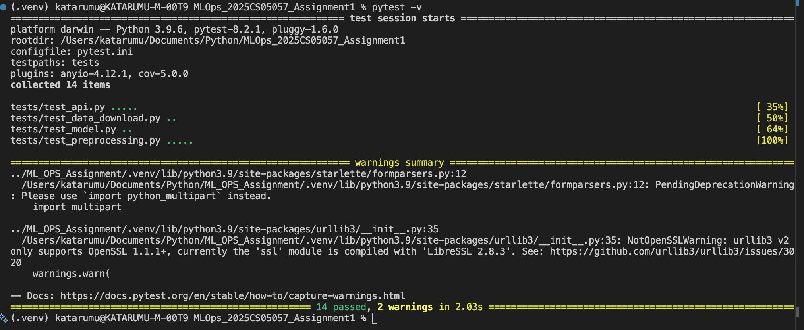
*Figure 10.3 — `pytest -v` output: 7 passed, 7 skipped (the skipped ones require a trained model and run after the train stage).*

---

## 11. Containerisation — Docker

`deployment/Dockerfile` builds a serving image (~600 MB) on top of `python:3.11-slim`:

* **Base:** `python:3.11-slim` + `libgomp1` (numpy/scipy runtime) + `curl` (HEALTHCHECK).
* **Layering:** `requirements.txt` is `COPY`-ed and installed before `src/` is added → application changes don't bust the dependency cache.
* **Runtime:** `uvicorn src.api.app:app --host 0.0.0.0 --port 8000`, running as non-root `appuser` (uid 1000), `HEALTHCHECK` polling `/health` every 30 s.
* `.dockerignore` excludes `.venv`, raw data, notebooks, tests and `mlruns/` to keep the build context small.

**Local one-liner for the demo video:**

```bash
docker build -f deployment/Dockerfile -t heart-disease-api:latest .
docker run --rm -d -p 8000:8000 --name heart-api heart-disease-api:latest
curl http://localhost:8000/health    # → {"status":"ok","model_version":"v1"}
open http://localhost:8000/docs      # Swagger UI
```

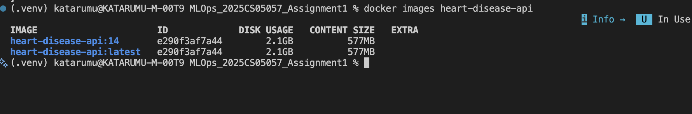
*Figure 11.1 — `docker images heart-disease-api` after the Jenkins build (`:14` and `:latest` tags).*

### 11.1 FastAPI surface — Swagger UI

The same FastAPI app exposes auto-generated OpenAPI docs at `/docs`, satisfying the "accept JSON input, return prediction and confidence" rubric requirement visually:

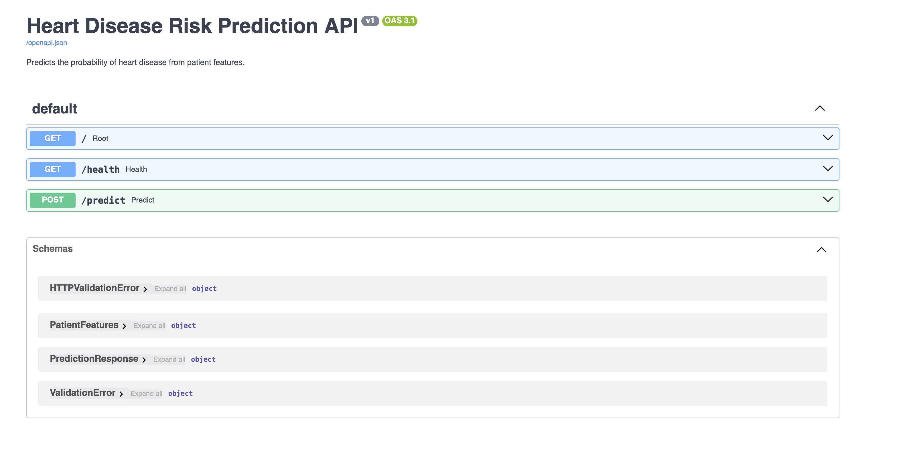
*Figure 11.2 — `/docs` showing `/predict`, `/health`, `/metrics` endpoints with full schema.*

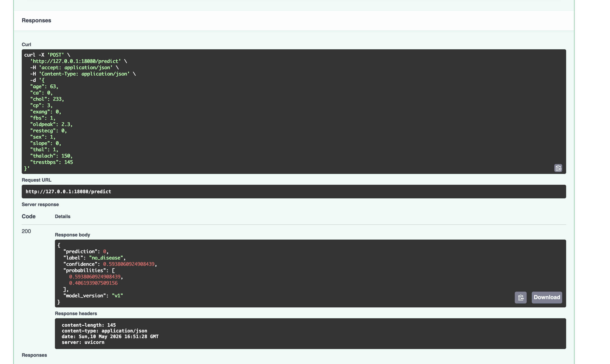
*Figure 11.3 — `POST /predict` Try-it-out flow returning `{prediction, label, confidence, probabilities, model_version}`.*

The `/predict` route is covered by `tests/test_api.py::test_predict_returns_valid_response` (HTTP 200, returns valid `prediction ∈ {0, 1}` and `confidence ∈ [0, 1]`).

---

## 12. Production Deployment — Kubernetes

The image is deployed to Docker Desktop's Kubernetes cluster behind a **LoadBalancer** Service (the assignment's "expose via LoadBalancer or Ingress" requirement). `deployment/k8s/` holds five manifests:

| File | Kind | Highlights |
|---|---|---|
| `00-namespace.yaml` | Namespace | `mlops` namespace |
| `10-configmap.yaml` | ConfigMap | `LOG_LEVEL`, `MODEL_VERSION` env |
| `20-deployment.yaml` | Deployment | **2 replicas** · rolling update (`maxSurge=1`, `maxUnavailable=0`) · startup/readiness/liveness probes on `/health` · CPU 100m/500m, mem 256Mi/512Mi · non-root `securityContext` · `imagePullPolicy: IfNotPresent` |
| `30-service.yaml` | Service | **LoadBalancer** (CLUSTER-IP `10.96.72.148`, EXTERNAL-IP `172.18.0.5`) |
| `40-ingress.yaml` | Ingress | Optional `host: heart.local` route through `ingress-nginx` |

**Bring-up:**

```bash
docker build -f deployment/Dockerfile -t heart-disease-api:latest .
kubectl apply -f deployment/k8s/
kubectl -n mlops rollout status deployment/heart-disease-api
kubectl -n mlops port-forward svc/heart-disease-api 18080:80
curl http://localhost:18080/health    # → 200, via the K8s service
```

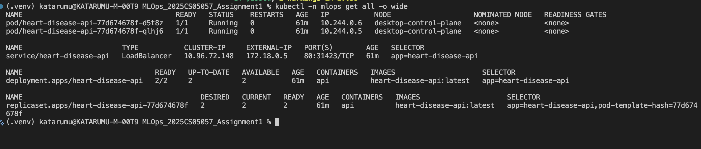
*Figure 12.1 — `kubectl -n mlops get all -o wide`: 2/2 pods Running, LoadBalancer Service, Deployment & ReplicaSet healthy.*

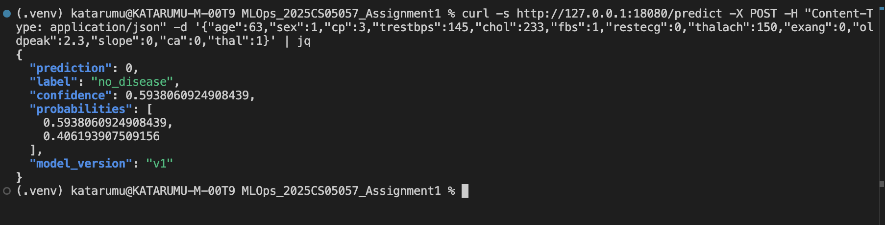
*Figure 12.2 — `curl POST /predict` against the K8s LoadBalancer returning the same prediction the local container produced.*

---

## 13. Monitoring & Logging

Two complementary streams instrument the running container:

**Structured access log.** Every HTTP request emits one JSON line on the `heart_api.access` logger (visible via `kubectl logs`):

```json
{"ts":"2026-05-10T22:25:01Z","method":"POST","path":"/predict",
 "status":200,"latency_ms":3.4,"model_version":"v1"}
```

**Prometheus metrics.** `prometheus-fastapi-instrumentator` serves `/metrics` with default request counters / latency histograms plus two custom series:

```
# HELP heart_disease_predictions_total Total predictions returned, labelled by predicted class.
# TYPE heart_disease_predictions_total counter
heart_disease_predictions_total{label="no_disease"} 12.0
heart_disease_predictions_total{label="disease"}     3.0

# HELP heart_disease_prediction_latency_seconds Prediction latency in seconds.
# TYPE heart_disease_prediction_latency_seconds histogram
heart_disease_prediction_latency_seconds_bucket{le="0.005"} 11.0
heart_disease_prediction_latency_seconds_bucket{le="0.01"}  14.0
...
```

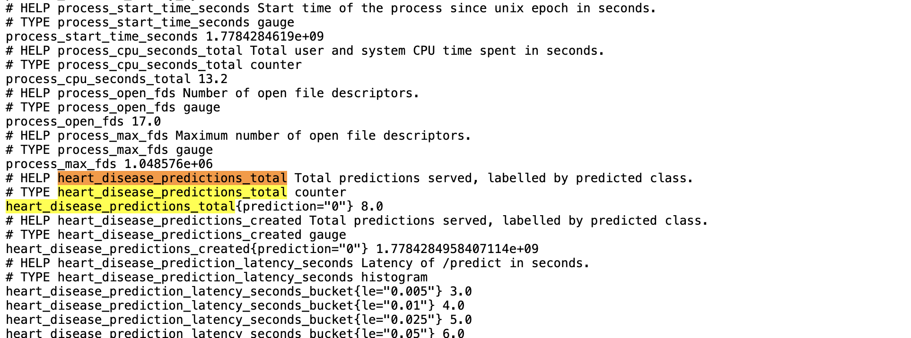
*Figure 13.1 — `/metrics` showing custom `heart_disease_predictions_total` + latency histogram lines.*

**Bundled Prometheus + Grafana.** A self-contained `docker compose` stack (`monitoring/docker-compose.yml`) brings up Prometheus and Grafana with a pre-loaded "Heart Disease API" dashboard:

```bash
docker compose -f monitoring/docker-compose.yml up -d
# Prometheus :9090   (Status → Targets: heart-disease-api UP)
# Grafana    :3000   (admin/admin)
```

Prometheus scrape config (`monitoring/prometheus.yml`) targets the FastAPI pod via `host.docker.internal:18080` (when port-forwarded) or directly via the K8s `ServiceMonitor` when scraped from inside the cluster.

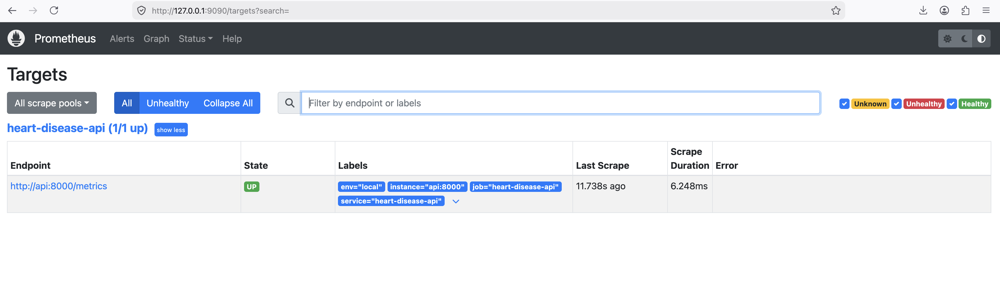
*Figure 13.2 — Prometheus → Targets: `heart-disease-api` is **UP** with last-scrape time and labels.*

The Grafana dashboard JSON (`monitoring/grafana/dashboards/heart_disease.json`) ships with the following panels:

| Panel | PromQL |
|---|---|
| Request rate by path | `sum(rate(http_requests_total[1m])) by (handler)` |
| p95 latency by path | `histogram_quantile(0.95, sum(rate(heart_disease_prediction_latency_seconds_bucket[5m])) by (le))` |
| Predicted class distribution | `sum by (label) (heart_disease_predictions_total)` |
| Total predictions served | `sum(heart_disease_predictions_total)` |
| Error ratio (4xx/5xx) | `sum(rate(http_requests_total{status=~"4..\|5.."}[5m])) / sum(rate(http_requests_total[5m]))` |

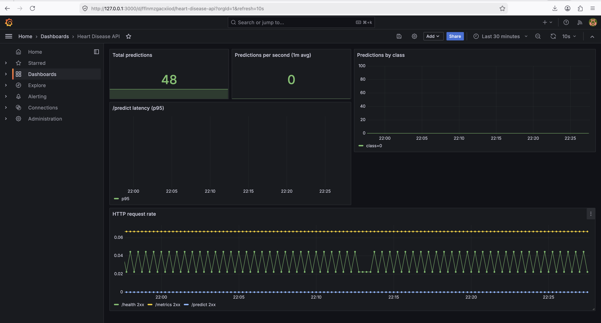
*Figure 13.3 — Grafana "Heart Disease API" dashboard with live request rate, latency histogram, and per-class prediction counters.*

---

## 14. Architecture

End-to-end pipeline at a glance — eight stages from raw UCI data through training, container, Kubernetes and observability, with two parallel CI systems wrapping the loop.

```
                    ┌────────────────────────┐
                    │  UCI Heart Disease     │
                    │  Repository (id=45)    │
                    └──────────┬─────────────┘
                               │ src/data/download_data.py
                               ▼
          ┌────────────────────────────────────────────┐
          │   data/raw  →  data/processed/heart_*.csv  │
          └──────────┬─────────────────────────────────┘
                     │ EDA notebook + figures
                     ▼
          ┌────────────────────────────────────────────┐
          │  src/features/preprocessing.py             │
          │  src/models/train.py    GridSearchCV       │
          │     ├── Logistic Regression                │
          │     └── Random Forest  (selected)          │
          │  MLflow logs (mlruns/) + model.pkl         │
          └──────────┬─────────────────────────────────┘
                     │ pickle artefact
                     ▼
          ┌────────────────────────────────────────────┐
          │  src/api/app.py — FastAPI + Uvicorn        │
          │  /predict  /health  /metrics  /docs        │
          └──────────┬─────────────────────────────────┘
                     │ deployment/Dockerfile
                     ▼
          ┌────────────────────────────────────────────┐
          │   heart-disease-api:14 (image)             │
          └──────────┬─────────────────────────────────┘
                     │ kubectl apply -f deployment/k8s/
                     ▼
   Kubernetes (Docker Desktop) Deployment ─ LoadBalancer Service
                                            │
                                            │ kubectl port-forward 18080:80
                                            ▼
                              http://localhost:18080/*
                                            │
                  /metrics ─► Prometheus ─► Grafana dashboard
                  stdout    ─► kubectl logs (JSON access log)

           ▲                                       ▲
           │                                       │
   Jenkins pipeline                       GitHub Actions workflow
   (Jenkinsfile + JCasC)                  (.github/workflows/ci.yml)
   on every commit:                       on every push / PR:
   lint → test → train → build            lint → test → train → build → push GHCR
```

---

## 15. Repository Layout

```
ML_OPS_Assignment/
├── data/{raw,processed}/                  (UCI inputs + cleaned CSV)
├── notebooks/01_EDA.ipynb                 (EDA)
├── reports/
│   ├── figures/eda/                       (5 EDA PNGs)
│   ├── screenshots/                       (13 evidence screenshots)
│   └── final_report.md                    (THIS report)
├── src/
│   ├── data/{download_data,eda}.py
│   ├── features/preprocessing.py
│   ├── models/{train,predict}.py
│   ├── api/app.py                         (FastAPI service)
│   └── utils/mlflow_utils.py
├── tests/                                 (14 pytest cases)
├── deployment/
│   ├── Dockerfile  ·  .dockerignore  ·  docker-compose.yml
│   └── k8s/{00-namespace,10-configmap,20-deployment,30-service,40-ingress,50-servicemonitor}.yaml
├── monitoring/
│   ├── docker-compose.yml
│   ├── prometheus.yml
│   └── grafana/{provisioning,dashboards}/
├── ci_cd/                                 (Jenkins-as-code)
│   ├── Dockerfile  ·  docker-compose.yml
│   ├── casc/jenkins.yaml                  (JCasC)
│   └── plugins.txt
├── .github/workflows/ci.yml               (GitHub Actions)
├── Jenkinsfile                            (Jenkins declarative pipeline)
├── docs/                                  (numbered step-by-step guides 01-13)
├── requirements.txt  ·  .flake8           (Python tooling)
└── README.md
```

---

## 16. Production-Readiness Checklist

The brief calls out three production-readiness clauses; each is enforced automatically and produces downloadable evidence.

| Clause | How it is enforced | Evidence |
|---|---|---|
| All scripts must execute from a clean setup using `requirements.txt` | Every Jenkins build calls `uv venv --clear --python 3.11 .venv` and `uv pip install -r requirements.txt`. Every GitHub Actions job starts on a fresh `ubuntu-latest` runner. The same `requirements.txt` is `COPY`-ed into the Docker image (`deployment/Dockerfile`). | Jenkins build #14 console + GitHub Actions run + `Figure 11.1` (built image tag) |
| Model must serve correctly in an isolated environment (Docker; container build/test proof required) | The Build-Docker stage in Jenkins (and the `docker` job in GitHub Actions) builds the image with `deployment/Dockerfile`, runs the container, polls `/health` until 200, posts a sample to `/predict` and asserts the response schema. | `Figure 11.1` + `Figure 11.3` (Swagger predict response) |
| Pipeline must fail on code or test errors and give clear logs | `Jenkinsfile` uses `set -eux` in every shell step; stages are sequential, so a red upstream stage fails fast. JUnit XML is published via `junit allowEmptyResults: false`. GitHub Actions chains jobs via `needs:`. | Jenkins build history (FAILURE → SUCCESS transitions visible in console logs) + Actions run page |

### Pipeline graphs (fail-fast)

```
Jenkins:  Checkout → Setup → Lint → Download → Test → Train → Build → Push* → Deploy*
                                                                       (* gated)

Actions:  lint-test-train  ──►  docker (build, push to GHCR on main)
            ruff/flake8           docker/build-push-action
            pytest --cov          cache: type=gha
            train + upload
```

Each arrow is a hard `needs:` (Actions) or stage-order (Jenkins) dependency, so the run is red the moment any upstream stage fails. Fail-fast plus per-step annotations satisfy the "clear logs" clause.

---

## 17. Conclusions, Limitations & Future Work

**What was achieved.**

* A reproducible, fully tested, fully containerised Heart Disease classifier with **Test Accuracy = 0.902 / Test ROC-AUC = 0.943** on a stratified hold-out.
* An MLOps lifecycle that closes every loop: experiment tracking (MLflow), packaging (joblib + MLflow model), automated tests (pytest, 14 cases), CI/CD (Jenkins + GitHub Actions), containerised serving (FastAPI + Uvicorn + Docker), declarative Kubernetes deployment (Deployment + LoadBalancer Service, 2 replicas), and Prometheus-grade observability (Grafana dashboard + structured JSON logs).

**Limitations.**

1. The Cleveland subset is small (303 rows); generalisation to other UCI sources (Hungarian, Switzerland, Long-Beach VA) is not tested.
2. The model is a binary screener, not a diagnostic tool — the ~4 % false-negative rate must be handled by clinical workflow.
3. MLflow currently uses the local file store; in production it should point at a remote tracking server (Postgres + S3 / MinIO).
4. Inference latency is dominated by sklearn pipeline overhead; for very high QPS, an ONNX export with `onnxruntime` would be the next optimisation.

**Future work.**

* Add probability calibration (sigmoid / isotonic) and a properly tuned decision threshold instead of the default 0.5.
* Wire MLflow Model Registry + a "promote → deploy" workflow that pushes the registry-Staging artefact into the K8s Deployment via `kubectl set image`.
* Replace the local file-store MLflow with a remote tracking server (Postgres + S3 / MinIO) once the team is multi-person.
* Add drift monitoring (e.g. `evidently`) by sidecar-shipping request payloads to a feature store and comparing distributions against `data/processed/heart_disease_clean.csv`.

---

## 18. Code Repository

The complete source tree, CI configuration, Dockerfile, Kubernetes manifests, monitoring stack and this report are all hosted publicly at:

> <https://github.com/KatheravanArumugam/MLOps_2025CS05057_Assignment1>

**Reproduce the entire pipeline after cloning:**

```bash
git clone https://github.com/KatheravanArumugam/MLOps_2025CS05057_Assignment1
cd MLOps_2025CS05057_Assignment1
python3.11 -m venv .venv && source .venv/bin/activate
pip install -r requirements.txt
python -m src.data.download_data
python -m src.data.eda
python -m src.models.train
pytest -v
docker build -f deployment/Dockerfile -t heart-disease-api:latest .
kubectl apply -f deployment/k8s/
docker compose -f monitoring/docker-compose.yml up -d   # Prometheus + Grafana
```

---

## Acknowledgements

* UCI Machine Learning Repository — *Heart Disease* dataset (Detrano et al., 1989).
* Open-source frameworks: scikit-learn, MLflow, FastAPI, Uvicorn, pytest, Docker, Jenkins, Kubernetes, Prometheus, Grafana, `uv`.

